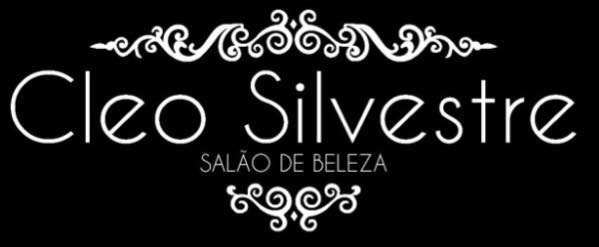

### PRÉ-REQUISITOS

- Instalar NodeJS
- Rodar um `npm install` dentro do projeto.

- No VSCODE, instalar os plugins do ESLint e Prettier

### INDEX.HTML

- Sempre colocar um texto claro no ALT das imagens, para que os leitores de tela leiam corretamente:
  Ex: ``

- Cuidado ao fechar as tags corretamente:
  Ex: `<h3><strong>MAQUIAGEM</h3></strong>` -> `<h3><strong>MAQUIAGEM</strong></h3>`

- Evitar deixar atributo ALT vazio:

```
  
```

- Evitar estilos duplicados. Isso pode ser feito utilizando as classes CSS.
  EX:

  ```
  <span style="background-color: white" class="icon-bar"></span>
  <span style="background-color: white" class="icon-bar"></span>
  <span style="background-color: white" class="icon-bar"></span>
  ```

  `.icon-bar { background-color: white }`

### CONTATO.HTML

- Evitar colocar estilos diretos na página, como por exemplo: `whatswidget-style`. Melhor criar um arquivo `whatswidget-style.css` e importar no inicio da página.
  Ex: <link rel="stylesheet" href="css/whatswidget-style.css" />

- Existem tags especificas para contatos. Dá uma olhada nesse link: https://www.w3schools.com/tags/tag_address.asp

### LOCAL.HTML

- Evitar o uso de `<iframe>`. Utilizá-lo em último caso.

- Evitar o uso de CSS inline. Sempre melhor criar uma classe CSS e utilizá-la.
  Ex:

  ```
  <button
      type="button"
      style="margin-top: 15px"
      class="navbar-toggle collapsed"
      data-toggle="collapse"
      data-target="#menu_lista"
    >
  ```

  Nesse caso, o certo seria remover o style e colcoar em uma classe chamada `.btn-margin` por exemplo:
  `.btn-margin { margin-top: 15px}`

  ```
  <button
      type="button"
      class="btn-margin navbar-toggle collapsed "
      data-toggle="collapse"
      data-target="#menu_lista"
      >
  ```
